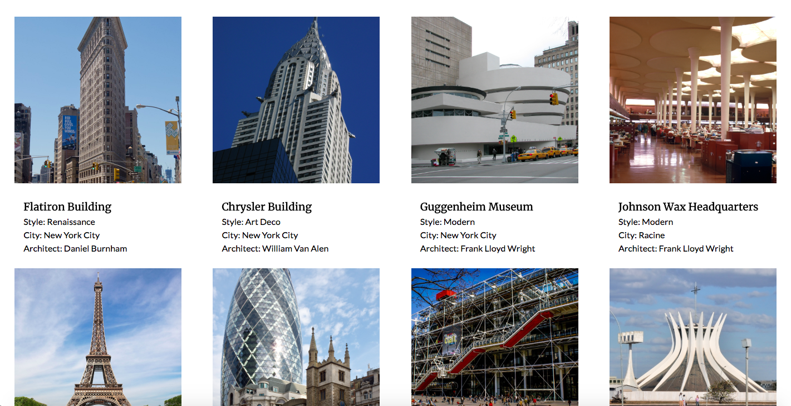

# React Express CRUD Lab cont'd

## Objective

- Show, Create, and Update views in React and Express

## Instructions

1. Fork and clone this repository.
2. `cd` into the `js-react-express-crud-part-two` folder.
3. Use `npm start` to start a server that will serve up your new application.
4. Check it out on [http://localhost:3000](http://localhost:3000)
5. As you progress with this exercise, check the webpage to make sure that your changes are being accurately reflected.
6. Remember, `React Developer Tools` are your friend. 

## Goal

TBD

## 🚀 Your homework submission should include:

- A pull request created on _this repo_.
- This homework is due 🚨 11PM SUNDAY 6/17 🚨
